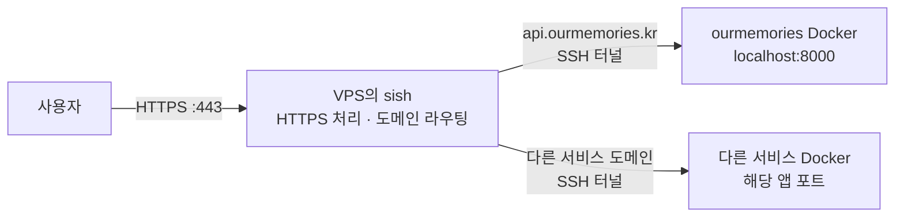

# sish 마이그레이션 검토안

현재의 사용 방식인 **“VPS에서 터널 서버를 한 번 실행하고, 서비스 Docker가 연결하면서 도메인을 등록한다”**를 유지하면서, Caddy와 원격 등록용 Python을 sish로 대체하는 예시다.

이 문서는 처음 작성한 검토용 설계안이다. 이후 이 안을 기준으로 [`v2_tunnel/`](v2_tunnel/README.md)에 별도 실행 구성을 구현하고, ourmemories Dockerfile의 기존 연결 명령을 주석으로 보관한 뒤 sish 연결 명령을 적용했다. 실제 적용 파일과 실행·복구 절차는 `v2_tunnel/README.md`를 따른다. 아래 예시는 설계 검토 당시의 형태다.

공식 sish 바이너리를 사용한 격리된 로컬 통합 테스트 7개는 통과했다. 실제 VPS 배포, Docker 이미지 빌드·실행, 공인 인증서 발급 및 기존 구성과의 처리 성능 비교는 아직 수행하지 않았다.

## 유지할 운영 방식

- VPS에서 `./run_server.sh` 같은 간단한 명령으로 터널 서버를 실행한다.
- 각 서비스 Docker가 자신의 도메인과 앱 포트를 전달하면서 연결한다.
- 외부 트래픽은 VPS로 들어오고, VPS가 도메인에 따라 연결된 서비스로 전달한다.
- 서비스를 추가할 때 VPS의 도메인 목록을 수정하거나 터널 서버를 재시작하지 않는다.
- 서비스 연결이 종료되면 등록을 정리하고, 재연결하면 다시 등록한다.
- VPS에서 HTTPS를 처리한다.

SSH는 필수 요구사항은 아니지만, 이 sish 검토안에서는 SSH 연결과 기존 `autossh`를 사용한다.

## 현재 구성과 변경 후 구성

현재 요청 경로:

```text
사용자 → VPS의 Caddy → 서비스별 포트(9015 등) → SSH 터널 → 서비스 Docker
                         ↑
                  tunnel.py가 도메인 등록
```

현재 Python은 서비스 트래픽 자체를 전달하지 않는다. Caddy에 도메인과 포트를 등록하고, 연결 상태를 확인하고, 종료된 등록을 정리한다. 실제 요청은 Caddy와 SSH 포워딩을 통해 전달된다.

sish로 변경한 요청 경로:



각 Docker가 먼저 VPS의 sish SSH 포트인 `2222`로 연결한다. sish는 그 연결에서 요청한 도메인을 등록하고, 외부 HTTPS 요청을 도메인에 맞는 연결로 전달한다. 서비스마다 VPS 포트를 따로 배정할 필요가 없어진다. [sish HTTP 포워딩 설명](https://docs.ssi.sh/forwarding-types#http)

| 항목 | 현재 | sish 검토안 |
| --- | --- | --- |
| HTTPS와 도메인 라우팅 | Caddy | sish |
| 서비스 연결 대상 | VPS의 일반 SSH 서버 | VPS의 sish SSH 서버, `2222` |
| 도메인 등록 | SSH 포워딩 후 원격 `tunnel.py` 실행 | SSH 포워딩 요청에 도메인 포함 |
| 서비스별 VPS 포트 | `SSH_PORT=9015`처럼 개별 관리 | 필요 없음 |
| 등록·정리 코드 | 자체 Python 코드 | sish의 연결 및 등록 관리 기능 |
| 서버 실행·상태 확인 | `run_server.sh` → Python supervisor | `run_server.sh` → Docker Compose |

sish로 통합하면 직접 유지할 등록·정리 코드와 구성 요소를 줄일 수 있다. 다만 sish도 SSH를 사용하므로, 현재보다 요청 속도나 CPU·메모리 사용량이 더 좋다고 확인된 것은 아니다. 현재 Python을 제거하는 것만으로 요청 처리가 크게 빨라지는 구조도 아니다.

## VPS 파일 구성 예시

VPS에 Docker와 Docker Compose가 있다는 전제다.

```text
tunnel/
├── run_server.sh       # 시작·종료·상태 확인
├── compose.yml         # sish 설정
├── .env                # 서비스 연결 인증값
└── .runtime/sish/
    ├── ssl/            # HTTPS 인증서 저장
    ├── keys/           # sish SSH 서버 키 저장
    └── pubkeys/        # 공개키 인증을 사용할 경우의 허용 키
```

이 구성에서는 Caddy 전용 `server.py`, `caddy_config.json`, `tunnel.py`, `tunnel_common.py`, `tunnel_cleanup.py`가 맡던 역할의 상당 부분을 sish와 Compose에 넘긴다. 현재 supervisor의 준비 완료 확인과 watchdog은 별도 검토가 필요하므로, 기존 파일을 바로 삭제하는 작업까지 포함한 완성된 마이그레이션은 아니다.

### compose.yml

검토 시점에 확인한 공식 릴리스인 `v2.23.0` 이미지로 고정한 예시다. [공식 릴리스](https://github.com/antoniomika/sish/releases/tag/v2.23.0)

```yaml
services:
  sish:
    image: antoniomika/sish:v2.23.0
    restart: unless-stopped

    ports:
      - "80:80"
      - "443:443"
      - "2222:2222"

    volumes:
      - ./.runtime/sish/ssl:/ssl
      - ./.runtime/sish/keys:/keys
      - ./.runtime/sish/pubkeys:/pubkeys

    command:
      # 외부 요청과 서비스 연결을 받는 주소
      - --http-address=:80
      - --https-address=:443
      - --ssh-address=:2222
      - --domain=ourmemories.kr
      - --redirect-root=false

      # Docker가 요청한 도메인을 그대로 등록
      - --bind-any-host=true
      - --bind-root-domain=true
      - --bind-random-subdomains=false
      - --force-requested-subdomains=true

      # 서비스 Docker의 연결 인증
      - --authentication=true
      - --authentication-password=${SSH_PASSWORD:?Set SSH_PASSWORD in .env}
      - --authentication-keys-directory=/pubkeys
      - --private-keys-directory=/keys

      # HTTPS 인증서 자동 발급·갱신
      - --https=true
      - --force-all-https=true
      - --https-certificate-directory=/ssl
      - --https-ondemand-certificate=true
      - --https-ondemand-certificate-accept-terms=true

      # 조용한 WebSocket이나 오래 걸리는 요청을
      # 기본 5초 유휴 제한으로 끊지 않도록 설정
      - --idle-connection=false
```

도메인 등록 정책은 다음과 같다.

- `--bind-random-subdomains=false`: Docker가 요청한 도메인을 사용한다.
- `--force-requested-subdomains=true`: 해당 도메인이 사용 중이면 임의의 다른 주소를 할당하는 대신 등록을 실패시킨다.
- `--bind-any-host=true`: 인증해서 연결한 본인 서비스들이 자신의 도메인을 TXT 검증 없이 등록할 수 있게 한다.
- `--bind-root-domain=true`: 루트 도메인을 요청하는 경우에도 바인딩을 허용한다.
- `--redirect-root=false`: 루트 도메인의 기본 프로젝트 페이지 리다이렉트를 끈다.

이 예시는 본인 서비스들만 인증해서 연결하는 운영을 전제로 한다. 서비스마다 `_sish` TXT 레코드를 추가할 필요는 없으며, 각 서비스 도메인의 DNS는 VPS를 가리켜야 한다. [커스텀 도메인 설정](https://docs.ssi.sh/advanced#custom-domains)

등록할 주소가 모두 `ourmemories.kr`의 서브도메인이라면 `--bind-any-host=true` 대신 `--bind-hosts=ourmemories.kr`로 범위를 지정할 수도 있다. 여러 독립 도메인을 기존처럼 등록하려면 예시의 `--bind-any-host=true` 방식이 VPS의 도메인 목록을 매번 수정하지 않는 사용법에 맞는다.

HTTPS는 첫 HTTPS 접속 시 인증서를 발급하는 방식이다. 처음 접속에는 발급 시간이 추가될 수 있으며, 인증서와 SSH 서버 키는 볼륨에 저장한다. 현재 Caddy의 인증서 데이터를 자동으로 인계하는 설정은 이 예시에 포함하지 않았다.

sish의 기본 연결 유휴 제한은 5초다. 긴 요청과 활동이 없는 WebSocket 연결을 이 제한으로 끊지 않도록 예시에서는 `--idle-connection=false`를 설정했다. [HTTPS·도메인·연결 제한 옵션](https://docs.ssi.sh/cli)

### .env

서비스 Docker의 `SSH_PASSWORD`와 일치하는 값을 설정한다.

```dotenv
SSH_PASSWORD=replace-with-your-existing-ssh-password
```

이 값은 sish에 연결하기 위한 인증값이다. sish가 VPS의 Linux 계정 비밀번호를 자동으로 가져오는 것은 아니므로 서버 쪽에 한 번 설정한다. sish는 비밀번호와 공개키 인증을 모두 지원한다. [인증 설정](https://docs.ssi.sh/getting-started#authentication)

### run_server.sh

현재의 Python 호출을 Compose 호출로 바꾸는 예시다.

```bash
#!/bin/bash
set -eu

cd "$(dirname "$0")"
mkdir -p .runtime/sish/{ssl,keys,pubkeys}

case "${1:-start}" in
  start)
    exec docker compose up -d sish
    ;;
  status)
    exec docker compose ps sish
    ;;
  stop)
    exec docker compose stop sish
    ;;
  restart)
    exec docker compose up -d --force-recreate sish
    ;;
  logs)
    exec docker compose logs -f sish
    ;;
  --foreground)
    exec docker compose up sish
    ;;
  *)
    echo "Usage: $0 [start|status|stop|restart|logs|--foreground]" >&2
    exit 2
    ;;
esac
```

사용할 때는 지금처럼 실행한다.

```bash
./run_server.sh
./run_server.sh status
./run_server.sh restart
./run_server.sh stop
./run_server.sh logs
```

기본 실행은 백그라운드에서 컨테이너를 시작한다. 서비스 도메인 목록은 `compose.yml`에 넣지 않는다. 각 Docker가 연결하면서 등록하므로, 서비스를 추가할 때 VPS 설정을 수정할 필요가 없다.

## 서비스 Docker 변경 예시

현재 서비스 Dockerfile은 `/Users/jb/ourmemories/server/Dockerfile`이다. 터널 연결 부분에서 다음 두 작업을 함께 수행한다.

```sh
# VPS에 서비스별 포트를 만들고
-R 9015:localhost:8000

# 별도 원격 명령으로 도메인과 포트를 등록
/home/linuxuser/tunnel/tunnel.py api.ourmemories.kr 9015
```

sish에서는 포워딩 요청 자체에 도메인을 넣는다.

```sh
-R api.ourmemories.kr:80:localhost:8000
```

기존 Dockerfile의 `CMD`에서 터널 연결 부분을 바꾸면 다음 형태다.

```dockerfile
CMD sh -c "AUTOSSH_GATETIME=0 sshpass -p $SSH_PASSWORD autossh -M 0 -N -T \
    -p 2222 \
    -o StrictHostKeyChecking=no \
    -o UserKnownHostsFile=/dev/null \
    -o ServerAliveInterval=30 \
    -o ServerAliveCountMax=3 \
    -o ExitOnForwardFailure=yes \
    -R $SERVER_ENDPOINT:80:localhost:$PORT \
    linuxuser@158.247.248.94 < /dev/null & \
    doppler run -- bun run src/index.ts"
```

도메인과 앱 포트는 기존 환경변수로 전달한다.

```dockerfile
ENV SERVER_ENDPOINT=api.ourmemories.kr
ENV PORT=8000
```

변경되는 부분:

- 모든 서비스가 sish의 SSH 포트인 `2222`로 연결한다.
- `ENV SSH_PORT=9015`와 같은 서비스별 VPS 포트 설정은 빠진다.
- `/home/linuxuser/tunnel/tunnel.py ...` 원격 실행도 빠진다.
- `-N -T`로 원격 명령이나 터미널을 실행하지 않고 포워딩 연결을 유지한다.
- `autossh`가 연결 감지와 재연결을 계속 맡는다.

`-R` 안의 `:80:`은 sish에 HTTP 도메인 라우팅을 요청하는 값이다. 실제 앱은 계속 Docker 내부의 `8000`으로 연결되고, 외부 HTTPS는 VPS의 `443`에서 처리한다. 다른 서비스도 같은 `:80:`을 사용하면서 서로 다른 도메인을 등록할 수 있다. [포워딩 방식](https://docs.ssi.sh/forwarding-types#http)

## 변경 후 운영 흐름

1. VPS에서 `./run_server.sh`를 실행한다.
2. 서비스 Docker가 시작하면서 sish에 도메인을 등록한다.
3. 사용자가 해당 도메인으로 접속하면 sish가 연결된 Docker로 전달한다.
4. 연결 종료가 확인되면 sish가 해당 연결의 등록을 정리한다.
5. `autossh`가 재연결하면 도메인을 다시 등록한다.

새 서비스를 추가할 때는 서비스 Docker의 도메인과 앱 포트를 지정한다. VPS에서 Caddy 라우트를 수정하거나 Python 등록 명령을 별도로 실행하지 않는다.

## 실제 교체 시 남는 작업과 차이

기존 Caddy가 사용하는 `80/443`을 sish에 넘기고, 서비스 Docker들을 새 연결 명령으로 재시작해야 한다. 기존 서버를 종료하는 작업은 새 wrapper로 파일을 교체하기 전에 기존 `run_server.sh`로 수행해야 한다. 이 단일 VPS 교체안은 무중단 전환 절차까지 설계한 것은 아니다.

현재의 모든 장애 처리까지 위 예시만으로 동일해지는 것은 아니다.

| 항목 | 현재 구현 | 위 예시의 차이 |
| --- | --- | --- |
| 시작 완료 판단 | Caddy admin API 준비 완료를 확인한 뒤 반환 | Compose가 컨테이너를 시작하며, 앱 준비 완료 확인은 별도 구현 필요 |
| 상태 확인 | supervisor·Caddy 상태와 준비 여부 표시 | Compose의 컨테이너 상태 표시 |
| 프로세스 종료 | supervisor가 Caddy 재시작 | Compose의 restart 정책이 컨테이너 재시작 |
| 프로세스는 살아 있지만 응답이 멈춘 경우 | 현재 watchdog이 상태를 확인하고 재시작 판단 | 위 예시에는 같은 watchdog을 구현하지 않음 |
| 인증서 발급 시점 | Caddy가 등록된 도메인의 인증서 관리 | sish의 첫 HTTPS 접속 시 발급 방식 사용 |

실제 서비스에서 현재와 같은 동작을 보장하려면 준비 완료 확인과 watchdog을 옮기고, 도메인 충돌 처리, 연결 종료 후 정리, 재연결, 긴 요청 및 WebSocket 동작을 비교해서 확인해야 한다.

이 검토안의 주된 이점은 VPS에서 직접 유지하던 등록·정리 코드의 상당 부분을 sish에 맡기는 것이다. 처리 성능을 이유로 교체하려면 같은 VPS에서 지연 시간, 업로드 처리량, CPU·메모리 사용량, 연결 복구 시간을 별도로 비교해야 한다.
