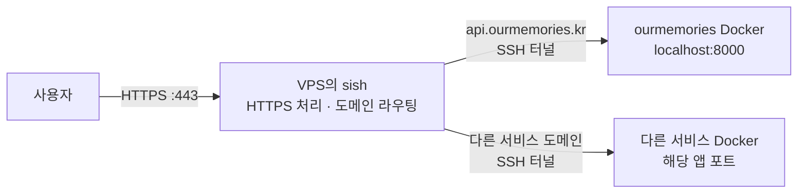

# sish 마이그레이션 검토안

현재의 사용 방식인 **“VPS에서 터널 서버를 한 번 실행하고, 서비스 Docker가 연결하면서 도메인을 등록한다”**를 유지하면서, Caddy와 원격 등록용 Python을 sish로 대체하는 예시다.

이 안을 기준으로 [`v2_tunnel/`](v2_tunnel/README.md)에 별도 실행 구성을 구현하고, ourmemories Dockerfile의 기존 연결 명령을 주석으로 보관한 뒤 sish 연결 명령을 적용했다. 현재 VPS 실행 방식은 **Docker와 Docker Compose 없이 `sh run_server.sh`로 공식 sish 바이너리를 직접 실행하는 방식**이다. 실제 실행·복구 절차는 `v2_tunnel/README.md`를 따른다.

macOS arm64에서 공식 sish v2.23.0 바이너리와 실제 `sh run_server.sh`를 사용하는 격리된 로컬 통합 테스트 13개가 모두 통과했다. 도메인 라우팅·연결 정리·긴 요청·WebSocket과 시작·종료·재시작·watchdog 복구를 검증했다. 실제 VPS 배포, Docker 이미지 빌드·실행, 공인 인증서 발급 및 기존 구성과의 처리 성능 비교는 아직 수행하지 않았다.

## 유지할 운영 방식

- VPS에서 `sh run_server.sh` 같은 간단한 명령으로 터널 서버를 실행한다.
- 각 서비스 Docker가 자신의 도메인과 앱 포트를 전달하면서 연결한다.
- 외부 트래픽은 VPS로 들어오고, VPS가 도메인에 따라 연결된 서비스로 전달한다.
- 서비스를 추가할 때 VPS의 도메인 목록을 수정하거나 터널 서버를 재시작하지 않는다.
- 서비스 연결이 종료되면 등록을 정리하고, 재연결하면 다시 등록한다.
- VPS에서 HTTPS를 처리한다.

SSH는 필수 요구사항은 아니지만, 이 sish 검토안에서는 SSH 연결과 기존 `autossh`를 사용한다.

## 현재 구성과 변경 후 구성

현재 요청 경로:

```text
사용자 → VPS의 Caddy → 서비스별 포트(9015 등) → SSH 터널 → 서비스 Docker
                         ↑
                  tunnel.py가 도메인 등록
```

현재 Python은 서비스 트래픽 자체를 전달하지 않는다. Caddy에 도메인과 포트를 등록하고, 연결 상태를 확인하고, 종료된 등록을 정리한다. 실제 요청은 Caddy와 SSH 포워딩을 통해 전달된다.

sish로 변경한 요청 경로:



각 Docker가 먼저 VPS의 sish SSH 포트인 `2222`로 연결한다. sish는 그 연결에서 요청한 도메인을 등록하고, 외부 HTTPS 요청을 도메인에 맞는 연결로 전달한다. 서비스마다 VPS 포트를 따로 배정할 필요가 없어진다. [sish HTTP 포워딩 설명](https://docs.ssi.sh/forwarding-types#http)

| 항목 | 현재 | sish 검토안 |
| --- | --- | --- |
| HTTPS와 도메인 라우팅 | Caddy | sish |
| 서비스 연결 대상 | VPS의 일반 SSH 서버 | VPS의 sish SSH 서버, `2222` |
| 도메인 등록 | SSH 포워딩 후 원격 `tunnel.py` 실행 | SSH 포워딩 요청에 도메인 포함 |
| 서비스별 VPS 포트 | `SSH_PORT=9015`처럼 개별 관리 | 필요 없음 |
| 등록·정리 코드 | 자체 Python 코드 | sish의 연결 및 등록 관리 기능 |
| 서버 실행·상태 확인 | `run_server.sh` → Python supervisor → Caddy | `sh run_server.sh` → Python supervisor → sish |

sish로 통합하면 직접 유지할 등록·정리 코드와 구성 요소를 줄일 수 있다. 다만 sish도 SSH를 사용하므로, 현재보다 요청 속도나 CPU·메모리 사용량이 더 좋다고 확인된 것은 아니다. 현재 Python을 제거하는 것만으로 요청 처리가 크게 빨라지는 구조도 아니다.

## VPS 파일 구성

VPS에는 기존처럼 Python 3(3.8 이상)를 사용한다. 추가 Python 패키지는 설치하지 않는다.

```text
tunnel/v2_tunnel/
├── run_server.sh       # POSIX sh 진입점
├── server.py           # 백그라운드 실행·시작 확인·정지·재시작·watchdog
├── config.py           # .env와 환경변수에서 sish 옵션 구성
├── install_sish.py     # 공식 바이너리 다운로드·SHA256 검증
├── wait_ready.py       # HTTP·HTTPS 포트·SSH 배너 확인
├── .env.example
└── .runtime/
    ├── bin/            # OS·CPU에 맞는 sish v2.23.0 실행 파일과 동봉 파일
    ├── ssl/            # 인증서 저장
    ├── keys/           # SSH 서버 키
    ├── pubkeys/        # 공개키 인증용
    └── server.log      # 회전 로그
```

기존 터널 서버 파일은 수정하지 않는다. sish가 HTTPS·도메인 등록·연결 정리를 처리하고, Python 관리 코드는 프로세스와 준비 상태만 관리한다. Python이 서비스 요청을 전달하는 구성은 아니다.

### 설정과 실행

```sh
cd /home/linuxuser/tunnel/v2_tunnel
cp .env.example .env
chmod 600 .env
nano .env
```

`.env`의 `SSH_PASSWORD`를 서비스 Docker에 전달하는 값과 같게 설정한다. sish가 Linux 계정 비밀번호를 자동으로 가져오지는 않는다.

```dotenv
SSH_PASSWORD='서비스 Docker와 같은 값'
SISH_DOMAIN=ourmemories.kr
SISH_BIND_ADDRESS=0.0.0.0
SISH_HTTP_PORT=80
SISH_HTTPS_PORT=443
SISH_SSH_PORT=2222
```

```sh
sh run_server.sh check
sh run_server.sh install  # 선택: 기존 서버를 내리기 전에 다운로드·검증
../run_server.sh stop     # 기존 Caddy의 80/443 해제
sh run_server.sh
sh run_server.sh status
```

첫 시작 시 Linux/macOS의 amd64·arm64를 구분해 공식 릴리스를 내려받고 체크섬을 검증한다. 이후에는 저장된 바이너리를 직접 실행한다. 기본 실행은 터미널과 분리되며, 시작 준비를 확인한 뒤 반환한다. `stop`, `restart`, `logs`, `--foreground`도 같은 sh 진입점으로 사용할 수 있다.

Linux의 낮은 포트 바인딩 권한이 필요하면 sish에 해당 권한을 부여하거나 `sudo sh run_server.sh`로 실행한다. 시작·상태 확인·종료는 같은 사용자와 권한으로 실행한다.

### 도메인 등록과 HTTPS

- Docker가 요청한 도메인을 그대로 등록한다.
- 같은 도메인이 사용 중이면 두 번째 등록을 거절하고 기존 연결을 유지한다.
- 인증된 본인 서비스들은 별도 TXT 검증 없이 여러 독립 도메인을 등록할 수 있다.
- 서비스 도메인의 DNS는 VPS를 가리켜야 한다.
- 첫 HTTPS 요청에서 인증서를 발급하고 `.runtime/ssl`에 저장한다.
- 긴 요청과 유휴 WebSocket을 sish의 기본 연결 유휴 제한으로 끊지 않도록 설정한다.

서비스마다 VPS의 도메인 목록을 수정할 필요가 없다. 세부 옵션은 [`v2_tunnel/config.py`](v2_tunnel/config.py)에 있고, 전체 운영 절차는 [`v2_tunnel/README.md`](v2_tunnel/README.md)에 있다. [공식 릴리스](https://github.com/antoniomika/sish/releases/tag/v2.23.0), [CLI 옵션](https://docs.ssi.sh/cli)

## 서비스 Docker 변경 예시

현재 서비스 Dockerfile은 `/Users/jb/ourmemories/server/Dockerfile`이다. 터널 연결 부분에서 다음 두 작업을 함께 수행한다.

```sh
# VPS에 서비스별 포트를 만들고
-R 9015:localhost:8000

# 별도 원격 명령으로 도메인과 포트를 등록
/home/linuxuser/tunnel/tunnel.py api.ourmemories.kr 9015
```

sish에서는 포워딩 요청 자체에 도메인을 넣는다.

```sh
-R api.ourmemories.kr:80:localhost:8000
```

기존 Dockerfile의 `CMD`에서 터널 연결 부분을 바꾸면 다음 형태다.

```dockerfile
CMD ["sh", "-c", "AUTOSSH_GATETIME=0 sshpass -p \"$SSH_PASSWORD\" autossh -M 0 -N -T \
    -p \"$TUNNEL_SSH_PORT\" \
    -o StrictHostKeyChecking=no \
    -o UserKnownHostsFile=/dev/null \
    -o ServerAliveInterval=30 \
    -o ServerAliveCountMax=3 \
    -o ExitOnForwardFailure=yes \
    -o ConnectTimeout=10 \
    -R \"${SERVER_ENDPOINT}:80:localhost:${PORT}\" \
    \"${TUNNEL_USER}@${TUNNEL_HOST}\" < /dev/null & \
    exec doppler run -- bun run src/index.ts"]
```

도메인과 앱 포트는 기존 환경변수로 전달한다.

```dockerfile
ENV SERVER_ENDPOINT=api.ourmemories.kr
ENV PORT=8000
ENV TUNNEL_HOST=158.247.248.94
ENV TUNNEL_SSH_PORT=2222
ENV TUNNEL_USER=linuxuser
```

변경되는 부분:

- 모든 서비스가 sish의 SSH 포트인 `2222`로 연결한다.
- `ENV SSH_PORT=9015`와 같은 서비스별 VPS 포트 설정은 빠진다.
- `/home/linuxuser/tunnel/tunnel.py ...` 원격 실행도 빠진다.
- `-N -T`로 원격 명령이나 터미널을 실행하지 않고 포워딩 연결을 유지한다.
- `autossh`가 연결 감지와 재연결을 계속 맡는다.

`-R` 안의 `:80:`은 sish에 HTTP 도메인 라우팅을 요청하는 값이다. 실제 앱은 계속 Docker 내부의 `8000`으로 연결되고, 외부 HTTPS는 VPS의 `443`에서 처리한다. 다른 서비스도 같은 `:80:`을 사용하면서 서로 다른 도메인을 등록할 수 있다. [포워딩 방식](https://docs.ssi.sh/forwarding-types#http)

## 변경 후 운영 흐름

1. VPS에서 `sh run_server.sh`를 실행한다.
2. 서비스 Docker가 시작하면서 sish에 도메인을 등록한다.
3. 사용자가 해당 도메인으로 접속하면 sish가 연결된 Docker로 전달한다.
4. 연결 종료가 확인되면 sish가 해당 연결의 등록을 정리한다.
5. `autossh`가 재연결하면 도메인을 다시 등록한다.

새 서비스를 추가할 때는 서비스 Docker의 도메인과 앱 포트를 지정한다. VPS에서 Caddy 라우트를 수정하거나 Python 등록 명령을 별도로 실행하지 않는다.

## 실제 교체 시 남는 작업과 차이

기존 Caddy가 사용하는 `80/443`을 sish에 넘기고 서비스 Docker들을 새 연결 명령으로 다시 빌드·실행해야 한다. 단일 VPS의 포트 전환 중에는 서비스 연결이 끊기는 시간이 발생한다. 실제 VPS와 서비스 컨테이너는 이 구현 과정에서 전환하지 않았다.

| 항목 | 현재 Caddy 구성 | sish 구현 |
| --- | --- | --- |
| 시작 완료 판단 | Caddy admin API 준비 확인 | HTTP 응답·HTTPS 포트·SSH 배너 확인 |
| 상태 확인 | supervisor·Caddy 상태 | supervisor·sish PID, 준비 상태, 재시작 횟수 |
| 프로세스 종료 | supervisor가 Caddy 재시작 | supervisor가 sish 재시작 |
| 응답 정지 | 기존 Caddy watchdog | HTTP·HTTPS 포트·SSH 배너 검사 실패 시 재시작 |
| 인증서 발급 | Caddy가 등록된 도메인의 인증서 관리 | 첫 HTTPS 접속 시 발급 |

sish watchdog은 개별 앱이나 TLS 인증서·HTTPS 응답 전체를 검사하지 않는다. 공인 인증서 발급과 서비스 Docker의 실제 자동 재접속은 VPS에서 추가 확인해야 한다. 기존 Caddy의 인증서 저장소를 자동으로 가져오는 기능은 포함하지 않는다.

이 변경의 주된 이점은 직접 유지하던 도메인 등록·연결 정리를 sish에 맡기는 것이다. 처리 성능을 이유로 교체하려면 같은 VPS에서 지연 시간, 업로드 처리량, CPU·메모리 사용량, 연결 복구 시간을 별도로 비교해야 한다.
